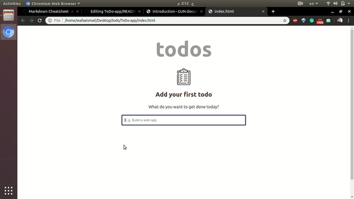

# ToDo-app

it is a simple todo list web app using html ,css , java script and gun database  

## Gun DataBase  
 it is a small, easy, and fast data sync and storage system that runs everywhere JavaScript does. The aim of GUN is to let you focus on the data that needs to stored, loaded, and shared in your app without worrying about servers, network calls, databases, or tracking offline . you can find more  [here](https://gun.eco/docs/Introduction). 
 
 ## Demo  

 

